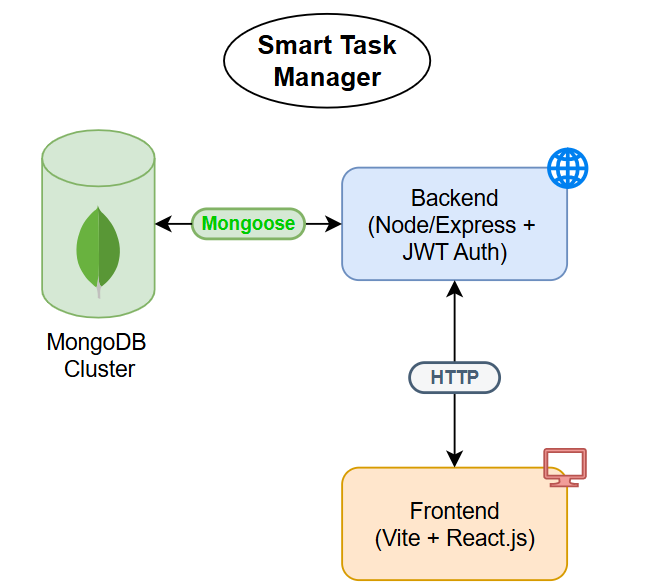
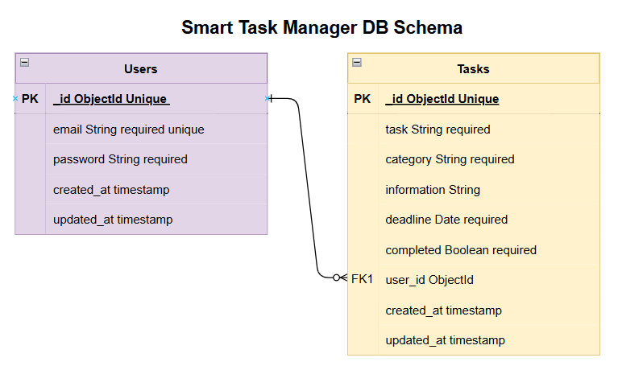

# 📘 Smart Task Manager

A full-stack productivity web app built to help users manage and categorize their tasks with deadlines, completion tracking and authentication.

---

## Table of Contents

- [Features](#features)
- [Architecture & Design](#architecture--design)
  - [Tech Stack](#tech-stack)
  - [Why This Stack?](#why-this-stack)
  - [Architecture Diagram](#architecture-diagram)
  - [Database Schema](#database-schema)
- [Installation & Setup](#installation--setup)
- [Usage Guide](#usage-guide)
- [Assumptions](#assumptions)
- [Future Improvements](#future-improvements)

---

## Features

- Add, update, and delete tasks
- Assign deadlines and track how long until they are due
- Mark tasks as completed
- Organize tasks by categories (e.g., Work, Personal, Learning, Other)
- User authentication (signup/login/logout)
- Context-based state management
- JWT-based secure API
- Mobile responsive design and clean UI
- Task validation (e.g., future deadline enforcement)
- Unit tests for backend and frontend logic

---

## Architecture & Design

### Tech Stack

| Layer          | Technology                 |
|----------------|----------------------------|
| Frontend       | React.js + Vite            |
| State Mgmt     | Context API + useReducer   |
| Styling        | CSS Modules                |
| Backend        | Node.js + Express.js       |
| Database       | MongoDB (via Mongoose)     |
| Auth           | JSON Web Tokens (JWT)      |
| Testing        | Vitest (frontend), Jest + Supertest (backend) |

---

### Why This Stack?

- **React + Vite**: Fast build times, modern tooling, excellent for modular UI.
- **Node + Express**: Lightweight and flexible, ideal for building RESTful APIs.
- **MongoDB**: Schemaless, perfect for a task manager with flexible fields.
- **JWT**: Secure, stateless authentication method.
- **Context API**: Simple, lightweight global state handling without external dependencies.

---

### Architecture Diagram



### Database Schema



---

## Installation & Setup

### Backend Setup

1. Navigate to the backend folder:
```bash
    cd backend
    npm install
```
2. Create a .env file in backend/ with the following:

```bash
PORT=3000
MONGO_URI=<your-mongodb-connection-string>
SECRET=<your-jwt-secret>
TEST_USER_ID=<Placeholder for running the API tests> (optional)
```

3. Start the server:

```bash
npm run dev
```

4. Optional: To run the API tests
```bash
npm test
```

### Frontend Setup

1. Open a new terminal and navigate to the `frontend` folder:

```bash
    cd frontend
    npm install
```
2. Start the development server:

```bash
    npm run dev
```

3. Optional: To run unit test
```bash
    npx vitest
```

---

## Assumptions
1. Authentication is handled using JWT stored in localStorage.
2. Each task is associated with a single user via user_id.
3. Deadline reminders are implemented as relative text (e.g., "Due in 2 days").
4. Assumes users interact via the frontend UI only.

---

## Future Improvements
🔔 Real-time deadline notifications
📊 Analytics dashboard (e.g., completed vs. overdue tasks)   
🔐 OAuth (Google, GitHub) login options  
📁 Task attachments (images, documents, links)    
📅 Calendar view for task deadlines  
📂 Archive or soft-delete functionality 
✅ Comprehensive unit and integration tests 